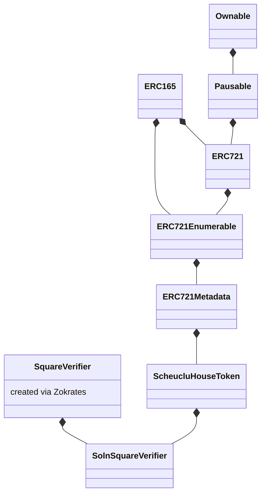

# Decentralized housing project

This is the capstone project for Udacitys Blockchain.
I have developed an toy ERC721 Token for buying and selling real estate.

A zero knowledge prrof is used to mint new tokens using zokrates.


## Links

The conracts are deployed on the rinkeby test net.

**[SquareVerifier.sol](./eth-contracts/contracts/SquareVerifier.sol)**: [0x9AFcF2755044D641a23F46A76F19551f0e8056ED](https://rinkeby.etherscan.io/address/0x9AFcF2755044D641a23F46A76F19551f0e8056ED)

**[SolnSquareVerifier.sol](./eth-contracts/contracts/SolnSquareVerifier.sol)**: [0x283d50A3e974f161476bE64b9C26A45D8983Fb61](https://rinkeby.etherscan.io/address/0x283d50A3e974f161476bE64b9C26A45D8983Fb61)


The tokens are listed on [**OpenSea**](https://testnets.opensea.io/collection/unidentified-contract-ujjaazssvg).


One house has successfully been [**sold**](https://testnets.opensea.io/assets/0x283d50a3e974f161476be64b9c26a45d8983fb61/0).


## Working with this repo

### Install dependencies
```bash
npm install
```

### Compile the contracts
```bash
cd eth-contracts
truffle test
```

### Test the contracts
```bash
cd eth-contracts
truffle test
```

Make sure you have local instance of Ganach running on port 8545.

### Deploy
Deploying contracts requires a wallet with sufficient balance (rinkeby test network) as well as an infura API key.

1. Create a file with your metamask mnemoic: `./eth-contracts/.secret`.
1. Create a file with your infura key: `./eth-contracts/.infura_key`.
1. Deploy to rinkeby:
```bash
cd eth-contracts
truffle migrate --reset --network rinkeby
```


## Contract hierarchy

Here's the contract hierarchy for this project:



