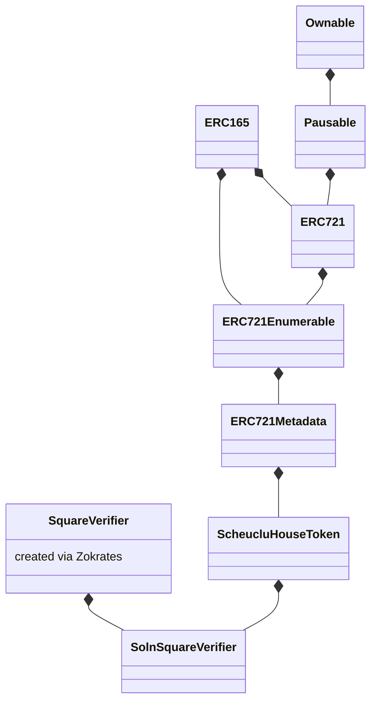

# Decentralized housing project

This is the capstone project for Udacitys Blockchain developer program.

## Contracts

Here's the contract hierarchy of the project

```mermaid
classDiagram
ERC165 *-- ERC721
Ownable *-- Pausable
Pausable *-- ERC721
ERC165 *-- ERC721Enumerable
ERC721 *-- ERC721Enumerable
ERC721Enumerable *-- ERC721Metadata
ERC721Metadata *-- ScheucluHouseToken
SquareVerifier *-- SolnSquareVerifier
ScheucluHouseToken *-- SolnSquareVerifier
class SquareVerifier{
    created via Zokrates
}
```
