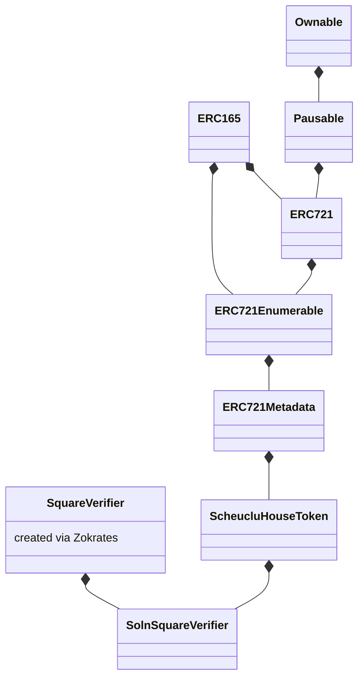

# Decentralized housing project

This is the capstone project for Udacitys Blockchain developer program.

## Deployed Contract

The contract address is

[0x283d50A3e974f161476bE64b9C26A45D8983Fb61](https://rinkeby.etherscan.io/address/0x283d50A3e974f161476bE64b9C26A45D8983Fb61)

The tokens are listed on [OpenSea](https://testnets.opensea.io/collection/unidentified-contract-ujjaazssvg).

One house has successfully been [sold](https://testnets.opensea.io/assets/0x283d50a3e974f161476be64b9c26a45d8983fb61/0).

## Contracts

Here's the contract hierarchy of the project

